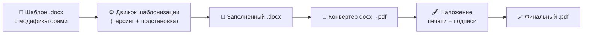

# 📄 Генератор шаблонных документов — Product Vision

## Суть продукта
Универсальный standalone-генератор юридических документов, который:
- Работает **полностью в браузере** (offline-first — данные не покидают устройство)
- Принимает `.docx` шаблон с модификаторами → заполняет данными → генерирует финальный `.pdf` с печатью и подписью
- Не привязан к CRM, работает с любым источником данных

---

## Целевая аудитория
**Средний/крупный бизнес** — юридические отделы, которым нужна автоматизация массовой генерации типовых договоров с разными контрагентами.

---

## Ключевые решения

### Шаблонизация
| Решение | Выбор |
|---------|-------|
| Движок | Собственный синтаксис, вдохновлённый Jinja2/Mustache |
| Синтаксис | `{{company.name}}`, ``, `` |
| Почему не Jinja2 напрямую | Jinja2 привязывает к Python-бэкенду; наш движок должен работать и в браузере (JS), и на сервере (Node.js) |

### Технологический стек
| Компонент | Технология |
|-----------|-----------|
| Язык | **TypeScript** |
| Фронтенд (MVP) | **SPA** (React/Vue/Vite) |
| Работа с .docx | `docx` / `docxtemplater` (работает в браузере) |
| Генерация PDF | `pdf-lib` (работает в браузере) |
| Печать/Подпись | Наложение изображений (PNG/SVG сканов) на PDF |

### Пайплайн генерации

---

## Конкурентные преимущества (Killer Features)

### 1. 🔒 Offline-first / Privacy-first
> Все данные обрабатываются **исключительно в браузере пользователя**. Ни один байт конфиденциальных договоров не отправляется на сервер. Ни PandaDoc, ни DocuSign, ни встроенный генератор Битрикс24 этого не предлагают.

### 2. 🌍 Многоязычные шаблоны
> Один шаблон может генерировать документ на двух языках (русский + казахский, русский + английский). Критически важно для компаний в Казахстане и международного бизнеса.

---

## Конкурентный анализ

| Продукт | Тип | Offline | Условия/Циклы | Универсальность | Многоязычность |
|---------|-----|---------|---------------|-----------------|----------------|
| **Наш продукт** | Standalone SPA | ✅ | ✅ | ✅ (любая CRM) | ✅ |
| Битрикс24 генератор | Плагин CRM | ❌ | ❌ (только подстановка) | ❌ (только Б24) | ❌ |
| Ging 2 (Jinja2) | Плагин Б24 | ❌ | ✅ (Jinja2) | ❌ (только Б24) | ❌ |
| PandaDoc | SaaS | ❌ | ⚠️ (ограниченно) | ✅ | ❌ |
| docxtemplater (JS lib) | Библиотека | ✅ | ✅ | ✅ | ❌ |

> **Вывод:** Ни один конкурент не сочетает одновременно: offline-обработку, мощную шаблонизацию с условиями/циклами, универсальность и многоязычность.

---

## Источники данных (MVP → Будущее)

| Фаза | Источник |
|------|---------|
| **MVP** | Веб-форма в UI (ручной ввод) |
| v2 | REST API / JSON |
| v3 | Загрузка из CSV/Excel (массовая генерация) |
| v4 | Прямые интеграции с CRM (Битрикс24, AmoCRM) |

---

## Монетизация
**Разовая покупка лицензии** — купил один раз, пользуешься всегда.
- Упрощает архитектуру (не нужны аккаунты, подписки, лимиты на старте)
- Дополнительный доход: платные обновления, библиотека премиум-шаблонов

---

## Платформа (Roadmap)

| Фаза | Платформа |
|------|-----------|
| **MVP** | Веб-приложение (SPA в браузере) |
| v2 | Десктоп-приложение (Electron или Tauri) |
| v3 | API-ядро как SDK/npm-пакет |

---

## Вопрос о Jinja2: Итоговое решение

> **Вердикт:** Jinja2 как движок **не внедряем** напрямую.

**Причины:**
1. Jinja2 — это Python-библиотека. Она не работает нативно в браузере, а наш MVP — это SPA (offline-first в браузере).
2. Привязка к Python ограничивает кроссплатформенность (браузер + Node.js + десктоп).
3. Полная мощь Jinja2 (макросы, наследование шаблонов, sandbox) избыточна для генерации договоров.

**Что берём от Jinja2:**
- Вдохновляемся **синтаксисом** (`{{...}}`, ``, ``) — он интуитивно понятен.
- Реализуем **подмножество** на TypeScript, покрывающее 95% бизнес-кейсов: переменные, условия, циклы, фильтры (`|uppercase`, `|date`, `|currency`).

---

## Следующий шаг
Когда вы будете готовы к разработке, мы можем:
1. Создать детальный `implementation_plan.md` с архитектурой и структурой проекта
2. Начать с ядра шаблонизатора (парсер + движок подстановки)
3. Собрать MVP веб-интерфейса
